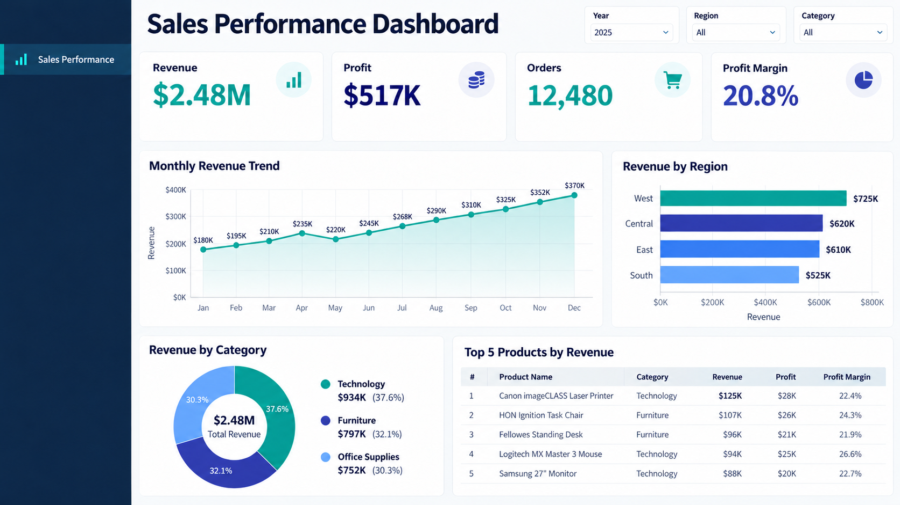

# Business Intelligence & Power BI Portfolio

**Business Intelligence Analyst | Power BI · DAX · Power Query · SQL**

I create Power BI reports for workforce, travel spending, and healthcare data. The dashboard screenshots in this portfolio are stored in the [`assets/`](assets/) folder.

## Portfolio overview

| Area | Dashboard examples | Business focus |
| --- | --- | --- |
| Sales | Sales performance | Revenue, profit, order volume, and margin by month, region, and category |
| Workforce | Manpower analytics | Headcount, workforce composition, hiring, termination, and tenure |
| Travel and cost | Travel expense and non lumpsum expense | Travel spend by period, destination, division, ticket, hotel, and airline |
| Healthcare | Provider, provider group, and diagnosis analysis | Inpatient claims, provider performance, diagnosis mix, and medical costs |

## Selected dashboards

### Sales performance dashboard

This dashboard brings sales performance into one view, with revenue, profit, order volume, and profit margin tracked across the year. Regional and category comparisons show where sales are strongest, while the monthly trend helps teams follow changes over time. The product table adds detail on top revenue contributors, supporting conversations about sales mix and areas for further review.

### Workforce analytics

This dashboard brings key workforce information into one view. HR teams can review current manpower, employee demographics, work location, and tenure, then compare hiring and termination activity. These measures help show how the workforce is changing and where further review may be useful.

### Travel expense overview

This dashboard helps teams understand how business travel spending changes over time. It compares expenses and transaction activity across destinations and divisions, making it easier to see where travel costs are concentrated and which areas may need closer review.

### Non lumpsum expense analysis

This dashboard focuses on ticket and hotel costs recorded outside the lump sum expense process. It also shows airline usage, giving finance and travel teams more detail when reviewing spending patterns and considering cost controls.

### Healthcare provider analysis, inpatient

This dashboard looks at inpatient claims from the provider perspective. It brings claim activity together with membership and geographic information, helping healthcare teams compare providers and understand how service use and costs vary by location.

### Inpatient diagnosis analysis

This dashboard organizes inpatient claims by diagnosis and ICD group. By viewing claim trends alongside medical costs, healthcare teams can see which conditions account for more activity or spending and decide where a closer review is needed.

### Healthcare provider group analysis

This dashboard compares healthcare provider groups using diagnosis mix, membership, and medical costs. The combined view helps teams understand how patient needs and spending differ across groups and supports provider network reviews.

> Images in this repository are dashboard previews. Interactive reports and underlying data are not included in these previews.

## Tools

Power BI, DAX, Power Query, SQL, Excel, data modeling, dashboard design, KPI development, and business requirement gathering.

## Repository

`assets` contains dashboard screenshots. `datasets` contains sample data for selected dashboard examples.

## Contact

You can contact me through my GitHub profile.
